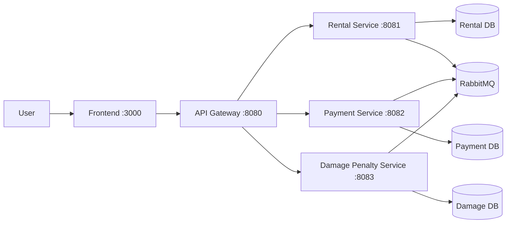

# Car Rental Management Module

[](https://github.com/hungdn1701/microservices-assignment-starter/stargazers)
[](https://github.com/hungdn1701/microservices-assignment-starter/network/members)
[](LICENSE)

> Car rental workflow automation with microservices: rental lifecycle management, payment/invoice processing, and damage/penalty handling through a unified API gateway.

> **New to this repo?** See [`GETTING_STARTED.md`](GETTING_STARTED.md) for setup instructions, workflow guide, and submission checklist.

---

## Team Members

| Name | Student ID | Role | Contribution |
|------|------------|------|-------------|
| Nguyễn Quý Hạnh | B22DCCN277 | Backend & Infrastructure | rental-service, docker-compose, gateway, integration |
| Nguyễn Anh Tuấn | B22DCCN757 | Backend & Frontend | payment-service, damage-penalty-service, frontend |

---

## Business Process

The module automates the vehicle rental lifecycle for a car rental domain: creating rentals, processing payments/invoices, recording damages, and managing penalties. Main actors are customer and staff; all interactions go through frontend -> gateway -> backend services.

---

## Architecture

*(Paste or update the architecture diagram from [`docs/architecture.md`](docs/architecture.md) here.)*



| Component     | Responsibility | Tech Stack | Port |
|---------------|----------------|------------|------|
| **Frontend**  | UI for rental/payment/damage workflows | Nginx + Vanilla JS | 3000 |
| **Gateway**   | Reverse proxy and unified API entrypoint | Nginx | 8080 |
| **Rental Service** | Rental lifecycle and state transitions | Spring Boot + MySQL | 8081 |
| **Payment Service** | Payments and invoices | Spring Boot + MySQL | 8082 |
| **Damage Penalty Service** | Damage reports and penalties | Spring Boot + MySQL | 8083 |

---

## Quick Start

```bash
docker compose up --build
```

Verify: `curl http://localhost:8080/health`

> For full setup instructions, prerequisites, and development commands, see [`GETTING_STARTED.md`](GETTING_STARTED.md).

---

## Documentation

| Document | Description |
|----------|-------------|
| [`GETTING_STARTED.md`](GETTING_STARTED.md) | Setup, workflow, submission checklist |
| [`docs/analysis-and-design.md`](docs/analysis-and-design.md) | Analysis & Design — Step-by-Step Action approach |
| [`docs/analysis-and-design-ddd.md`](docs/analysis-and-design-ddd.md) | Analysis & Design — Domain-Driven Design approach |
| [`docs/architecture.md`](docs/architecture.md) | Architecture patterns, components & deployment |
| [`docs/api-specs/`](docs/api-specs/) | OpenAPI 3.0 specifications for each service |

---

## License

This project uses the [MIT License](LICENSE).

> Template by [Hung Dang](https://github.com/hungdn1701) · [Template guide](GETTING_STARTED.md)

