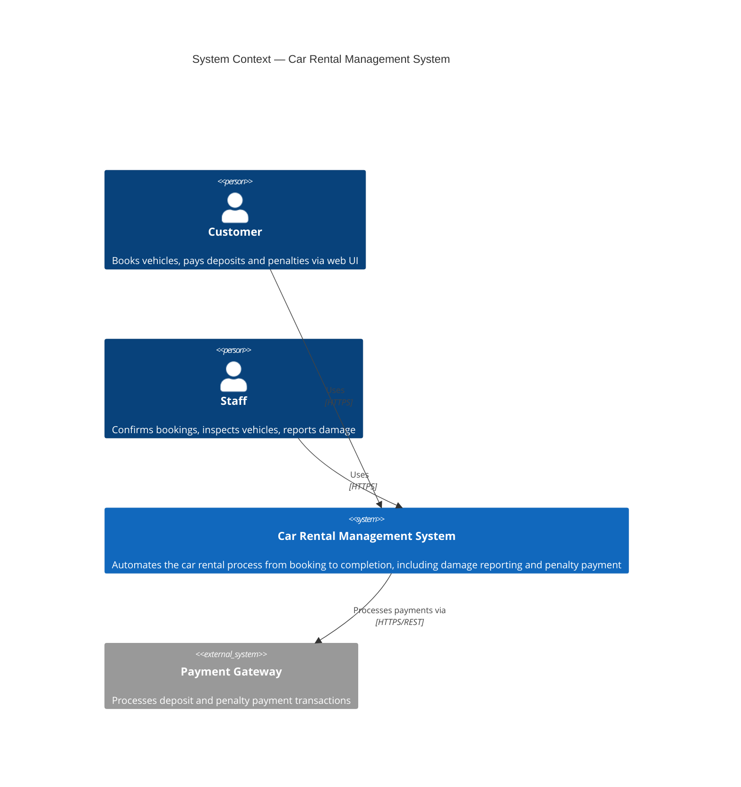
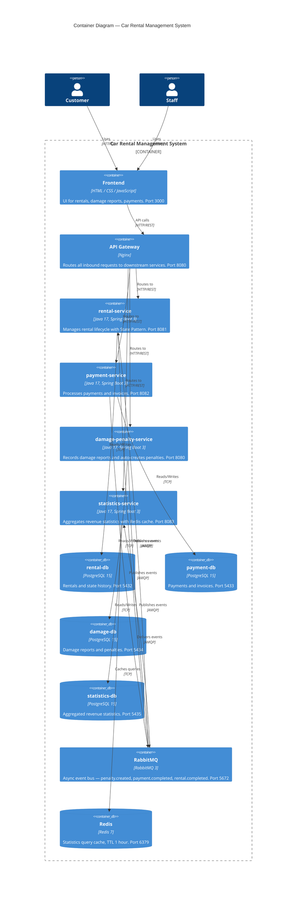

# System Architecture

> This document is completed **after** the Analysis and Design phase.
> Choose **one** analysis approach and complete it first:
> - [Analysis and Design — Step-by-Step Action](analysis-and-design.md)
> - [Analysis and Design — DDD](analysis-and-design-ddd.md)
>
> Both approaches produce the same inputs for this document: **Service Candidates**, **Service Composition**, and **Non-Functional Requirements**.

**References:**
1. *Service-Oriented Architecture: Analysis and Design for Services and Microservices* — Thomas Erl (2nd Edition)
2. *Microservices Patterns: With Examples in Java* — Chris Richardson
3. *Bài tập — Phát triển phần mềm hướng dịch vụ* — Hung Dang (available in Vietnamese)

---

### How this document connects to Analysis & Design

```
┌─────────────────────────────────────────────────────┐
│         Analysis & Design (choose one)              │
│                                                     │
│  Step-by-Step Action        DDD                     │
│  Part 1: Analysis Prep     Part 1: Domain Discovery │
│  Part 2: Decompose →       Part 2: Strategic DDD →  │
│    Service Candidates        Bounded Contexts       │
│  Part 3: Service Design    Part 3: Service Design   │
│    (contract + logic)        (contract + logic)     │
└────────────────┬────────────────────────────────────┘
                 │ inputs: service list, NFRs,
                 │         service contracts (API specs)
                 ▼
┌─────────────────────────────────────────────────────┐
│         Architecture (this document)                │
│                                                     │
│  1. Pattern Selection                               │
│  2. System Components (tech stack, ports)           │
│  3. Communication Matrix                            │
│  4. Architecture Diagram                            │
│  5. Deployment                                      │
└─────────────────────────────────────────────────────┘
```

> 💡 **What you need before starting:** your completed service list from Part 2 (service candidates and their responsibilities) and your service contracts from Part 3 (API endpoints). This document turns those logical designs into a concrete, deployable system architecture.

---

## 1. Pattern Selection

> **How to fill in this table:** Pattern choices must be traceable back to your analysis. Use the following inputs:
> - **NFRs (Part 1.3)** of your analysis document — e.g., "High Availability" → Circuit Breaker; "Independent Scalability" → Database per Service
> - **Service composition (Step-by-Step 2.8 or DDD 2.6–2.7)** — e.g., a long-running cross-service transaction → Saga; loose coupling between contexts → Event-driven
> - **Communication style from Part 3** — e.g., async notification requirements → Message Queue; read/write performance separation → CQRS
>
> Leave "Derived from" blank only if the pattern is selected for a reason not covered in the analysis (explain in Justification).

| Pattern | Selected? | Derived from (Analysis Step) | Business/Technical Justification |
|---------|-----------|------------------------------|----------------------------------|
| API Gateway | ✅ | 2.8 Service Composition | Single entry point for all client traffic; routes to rental, payment, damage-penalty, and statistics services |
| Database per Service | ✅ | 1.3 NFR: Scalability | Each service owns its own PostgreSQL database — prevents shared bottlenecks and allows independent scaling |
| Shared Database | ❌ | — | Rejected — would couple service deployments and prevent independent scaling |
| Saga | ❌ | — | Not needed — cross-service consistency is handled via async events (penalty.created, payment.completed) rather than distributed transactions |
| Event-driven / Message Queue | ✅ | 1.3 NFR: Availability + 2.8 Service Composition | RabbitMQ decouples services; a statistics or damage service outage does not block the core rental flow |
| CQRS | ✅ | 1.3 NFR: Performance | statistics-service separates read (Redis-cached queries) from write (event-driven updates) to achieve sub-1s response time |
| Circuit Breaker | ❌ | — | Not implemented in current scope; recommended for production to protect payment gateway calls |
| Service Registry / Discovery | ❌ | — | Not needed — Docker Compose DNS handles service-to-service routing by service name |

> Reference: *Microservices Patterns* — Chris Richardson, chapters on decomposition, data management, and communication patterns.

---

## 2. System Components

| Component | Responsibility | Tech Stack | Port |
|-----------|----------------|------------|------|
| **Frontend** | UI for customers and staff to manage rentals, view damage reports, and pay penalties | HTML / CSS / JavaScript | 3000 |
| **Gateway** | Single entry point — routes requests to downstream services | Nginx | 8080 |
| **rental-service** | Manages rental lifecycle: booking, pickup, return, completion (State Pattern) | Java 17, Spring Boot 3 | 8081 |
| **payment-service** | Processes deposit and penalty payments, generates invoices | Java 17, Spring Boot 3 | 8082 |
| **damage-penalty-service** | Records damage reports, auto-calculates repair costs, manages penalties | Java 17, Spring Boot 3 | 8080 |
| **statistics-service** | Aggregates and caches revenue statistics by month/quarter/year | Java 17, Spring Boot 3 | 8083 |
| **rental-db** | Stores rentals and rental state history | PostgreSQL 15 | 5432 |
| **payment-db** | Stores payments and invoices | PostgreSQL 15 | 5433 |
| **damage-db** | Stores damage reports and penalties | PostgreSQL 15 | 5434 |
| **statistics-db** | Stores aggregated revenue statistics | PostgreSQL 15 | 5435 |
| **RabbitMQ** | Async event bus between services | RabbitMQ 3 | 5672 |
| **Redis** | Caches statistics query results (TTL: 1 hour) | Redis 7 | 6379 |

---

## 3. Communication

### Inter-service Communication Matrix

> **How to fill in this table:**
>
> Each cell describes **how** the row component talks to the column component. Use one of the values below — choose based on your Pattern Selection (Section 1) and your service contracts (`docs/api-specs/`):
>
> | Value | Meaning | When to use |
> |-------|---------|-------------|
> | `REST` | Synchronous HTTP/JSON call | Default for Gateway → Service, Frontend → Gateway |
> | `gRPC` | Synchronous binary RPC (Protocol Buffers) | Service-to-service calls where performance matters; requires `x-grpc` filled in `service-*.yaml` |
> | `async/event` | Fire-and-forget via message broker (Kafka, RabbitMQ) | Cross-context notifications; requires `x-async-events` filled in `service-*.yaml` and Message Broker in diagram |
> | `TCP` | Direct database protocol | Service → its own database only (never cross-service DB access) |
> | `—` | No direct communication | Leave as `—`, do not leave blank |
>
> **Rules:**
> - A service should **only** connect to its **own** database (Database per Service pattern). If Service A and Service B share one database, mark it as `Shared DB` and justify in Section 1.
> - Frontend should **never** call a service directly — all traffic goes through the Gateway.
> - If two services need to exchange data, choose either `gRPC` (synchronous) or `async/event` (asynchronous) — not a direct database read across services.
>
> **Example (food delivery domain):**
>
> | From → To     | Order Service | Payment Service | Gateway | DB-Orders | DB-Payments |
> |---------------|---------------|-----------------|---------|-----------|-------------|
> | **Frontend**  | —             | —               | REST    | —         | — |
> | **Gateway**   | REST          | REST            | —       | —         | — |
> | **Order Svc** | —             | async/event     | —       | TCP       | — |
> | **Payment Svc**| async/event  | —               | —       | —         | TCP |

### Your Communication Matrix

> Replace the column/row headers with your actual service names from Section 2.

| From → To | Frontend | Gateway | rental-service | payment-service | damage-penalty-service | statistics-service | RabbitMQ | Redis |
|-----------|----------|---------|----------------|-----------------|------------------------|-------------------|----------|-------|
| **Frontend** | — | REST | — | — | — | — | — | — |
| **Gateway** | — | — | REST | REST | REST | REST | — | — |
| **rental-service** | — | — | — | — | — | — | async/event | — |
| **payment-service** | — | — | — | — | — | — | async/event | — |
| **damage-penalty-service** | — | — | — | — | — | — | async/event | — |
| **statistics-service** | — | — | — | — | — | — | async/event | TCP |

---

## 4. Architecture Diagram

> These diagrams represent the **full deployment view** — showing every runtime component as it actually runs in production/Docker Compose. This is the completed picture that corresponds to the logical service map you drew in your analysis (Context Map in DDD 2.6, or Service Composition in Step-by-Step 2.8).
>
> Update the diagrams below to match your actual components. Remove any components you are not using (e.g., remove the Message Broker block if you chose synchronous-only communication).

### 4.1 System Context (C4 Level 1)

Who uses the system and what external systems does it interact with?



### 4.2 Container Diagram (C4 Level 2) — Full Deployment View

All runtime containers and how they communicate. This is the **primary architecture diagram**.



> 💡 **How to adapt this diagram:**
> - Replace placeholder names with your actual service names from your analysis.
> - Uncomment the Message Broker block if you selected Event-driven pattern in Section 1.
> - Uncomment the Service Registry block if you selected Service Registry/Discovery in Section 1.
> - Change `HTTP/REST` to `gRPC` on any inter-service edge where you use gRPC (see `docs/api-specs/grpc-spec-guide.md`).
> - Add more `Container` or `ContainerDb` blocks for additional services or databases.

---

## 5. Deployment

- All services containerized with Docker
- Orchestrated via Docker Compose
- Single command: `docker compose up --build`

> 💡 **Service communication inside Docker Compose:** Use Docker Compose service names as hostnames (e.g., `http://service-a:5001`), not `localhost`. The Gateway handles all inbound external traffic on port 8080.

---

## API Specification Formats

Depending on your communication style, use the appropriate specification format:

| Communication Style | Format | Location |
|---------------------|--------|----------|
| Synchronous REST (HTTP) | OpenAPI 3.0 YAML | `docs/api-specs/service-*.yaml` |
| gRPC (binary, high-performance sync) | Protocol Buffers `.proto` | See [`docs/api-specs/grpc-spec-guide.md`](api-specs/grpc-spec-guide.md) |
| Async / Message Broker (Kafka, RabbitMQ) | AsyncAPI 2.x YAML | See [`docs/api-specs/async-spec-guide.md`](api-specs/async-spec-guide.md) |
